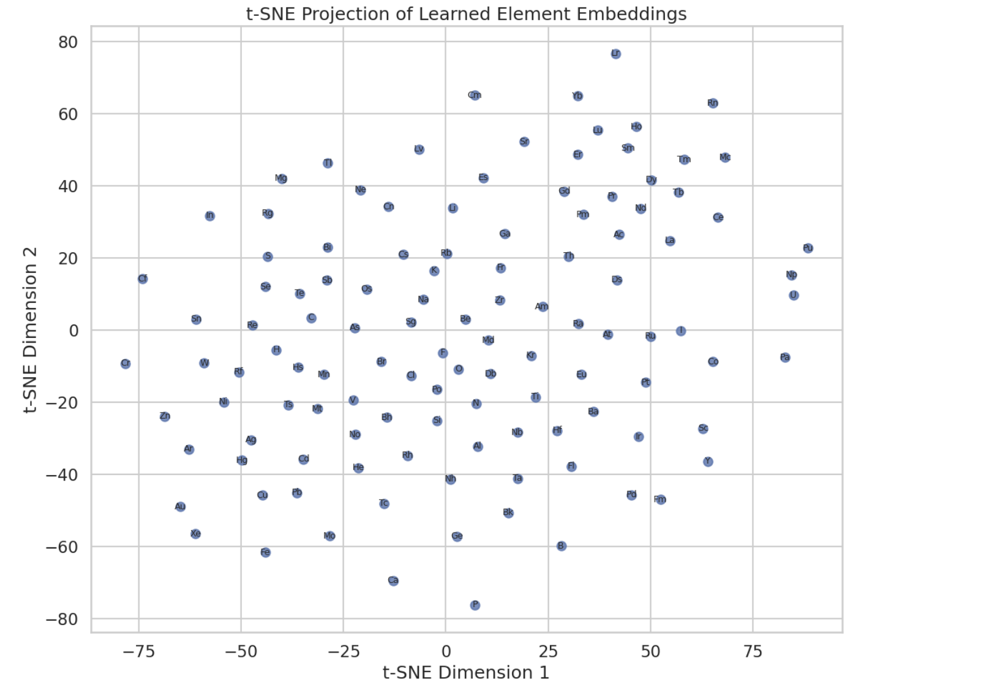
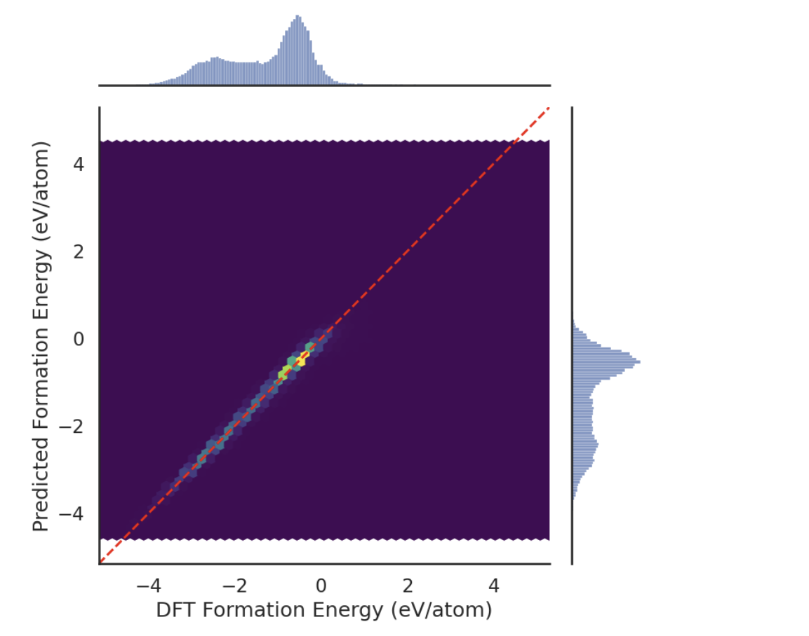
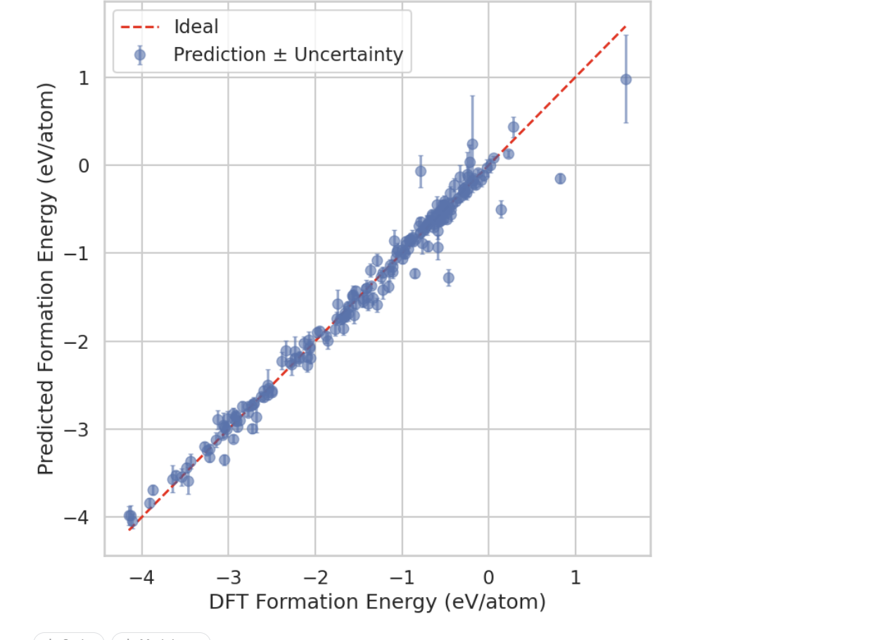
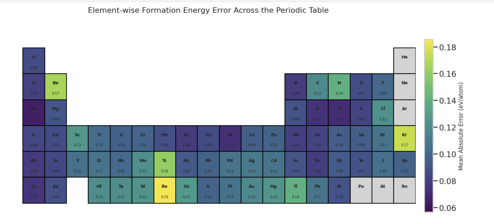

# Formation Energy Model Evaluation and Interpretability

This section presents a set of visualizations designed to evaluate the predictive performance and interpretability of the **formation energy prediction model** trained on the Materials Project dataset.

The figures below examine several important aspects of the model:

- The chemical representations learned by the neural network
- The overall regression accuracy of the formation energy predictions
- The reliability of uncertainty estimates
- Element-wise prediction behavior across the periodic table

Together, these visualizations demonstrate both the **predictive strength** and the **chemical interpretability** of the model.

---

# 1. t-SNE Projection of Learned Element Embeddings

This visualization shows a **t-SNE projection of the learned element embeddings** produced by the neural network during training.

The original embeddings exist in a **64-dimensional latent representation space** learned by the model. To visualize these representations, **t-distributed Stochastic Neighbor Embedding (t-SNE)** is applied to reduce the dimensionality to two dimensions while preserving relationships between elements.

Each point in the plot represents a chemical element. The spatial relationships between these points reflect how the model internally encodes similarities between elements.

### Significance

This visualization demonstrates that the model has implicitly learned **chemical relationships and periodic trends** directly from compositional data. Elements with similar chemical properties tend to appear closer in the embedding space.

This behavior indicates that the neural network has developed an internal representation of **chemical similarity**, effectively capturing patterns related to the periodic table without explicitly being given structural chemical rules.

### Comparison with Previous Work

Similar embedding analyses have been used in models such as **MEGNet**, where learned element embeddings revealed natural clustering of chemically similar elements. While MEGNet relies on crystal structural information, our model learns comparable chemical relationships **using only compositional inputs**, similar to the approach used by **Roost**. :contentReference[oaicite:0]{index=0}

---

# 2. Density-Aware Parity Plot with Marginal Histograms

This figure evaluates the overall predictive accuracy of the **formation energy regression model**.

The **x-axis** represents the ground-truth formation energy values calculated from density functional theory (DFT), while the **y-axis** represents the predicted formation energy values generated by the model.

A dashed diagonal line indicates the **ideal 1:1 relationship**, where predicted values perfectly match the true DFT values.

Instead of a traditional scatter plot, the visualization uses a **hexbin density representation**, which helps avoid over-plotting when dealing with large datasets. This approach reveals where the majority of predictions are concentrated.

Marginal histograms along the axes show the distribution of predicted and true formation energies.

### Interpretation

The densest region of the hexbin plot aligns closely with the diagonal parity line, indicating that the majority of predictions fall near the correct values. This suggests that the model achieves **strong regression performance with relatively localized prediction errors**.

### Comparison with Literature

Parity plots of this type are widely used in materials informatics research, including work on **MEGNet** and **DeeperGATGNN**, where similar density-based visualizations are used to summarize regression performance across large materials datasets. :contentReference[oaicite:1]{index=1}

---

# 3. Ensemble Predictions with Uncertainty Bounds

This visualization presents predictions from the **deep ensemble model along with uncertainty estimates**.

Each point corresponds to the predicted formation energy for a material in the dataset. The **vertical error bars represent ±1 standard deviation (σ)** across predictions from the ensemble models.

The dashed diagonal line represents the **ideal parity relationship** between predicted and true formation energies.

### Significance

Uncertainty estimation plays a critical role in **materials discovery workflows**, where machine learning models are used to screen thousands of candidate materials.

In this plot:

- Points close to the parity line indicate accurate predictions.
- Larger uncertainty bounds indicate that the model is less confident in its prediction.

Ideally, predictions with larger deviations from the parity line should also show larger uncertainty values. This indicates that the model can **recognize when it is uncertain**, which is an important property for practical deployment.

### Comparison with Existing Methods

Deep ensemble uncertainty estimation is a core component of the **Roost architecture**, which uses similar techniques to quantify prediction uncertainty in materials datasets. Our implementation adopts this strategy within a **multi-task learning framework**, simultaneously predicting formation energy and thermodynamic stability. :contentReference[oaicite:2]{index=2}

---

# 4. Element-wise Formation Energy Error Heatmap

This visualization maps the **mean absolute prediction error (MAE)** across the periodic table.

For each compound in the test set, the absolute error between the predicted and true formation energies is calculated. These errors are then aggregated across all materials containing each element.

The resulting values are displayed as a **periodic table heatmap**, where color intensity represents the magnitude of the prediction error associated with each element.

### Interpretation

This visualization provides an interpretable diagnostic view of model performance across different chemical spaces.

- **Lower error regions** indicate elements for which the model predicts formation energies accurately.
- **Higher error regions** may correspond to elements involved in complex bonding environments or elements that appear less frequently in the training dataset.

Such analysis helps identify **chemical domains where the model performs well and areas that may require additional training data or architectural improvements**.

### Comparison with State-of-the-Art Models

Periodic table analyses similar to this have been used in **CrabNet**, where element contributions and attention scores were mapped across the periodic table to understand model behavior. Our approach provides comparable interpretability while using a **lighter multi-task ensemble architecture**. :contentReference[oaicite:3]{index=3}

---

# Overall Interpretation

These visualizations collectively demonstrate that the model achieves:

- **Strong predictive accuracy** for formation energy prediction.
- **Meaningful uncertainty estimation**, enabling more reliable materials screening.
- **Chemically meaningful representations**, as shown by the learned element embeddings.
- **Interpretable performance diagnostics**, revealed through the periodic table error analysis.

Together, these results indicate that the model captures both **statistical relationships in the dataset and underlying chemical principles**, making it suitable for large-scale computational materials discovery.
