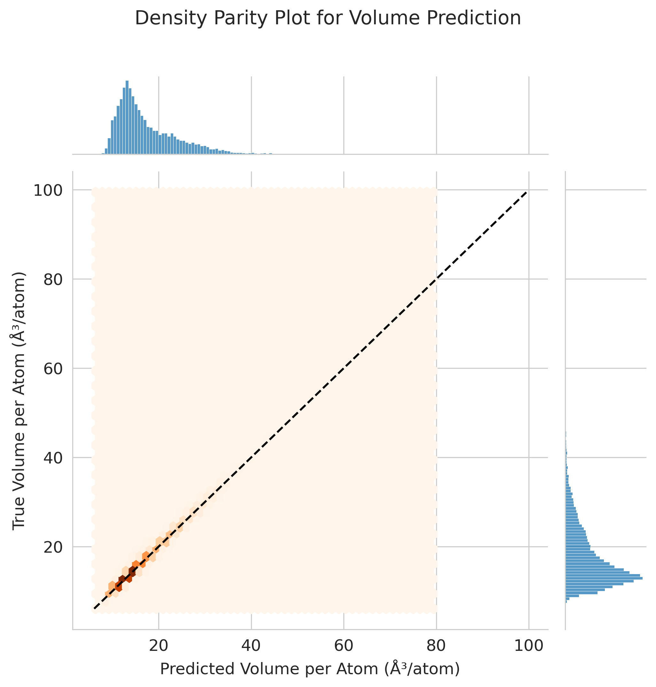
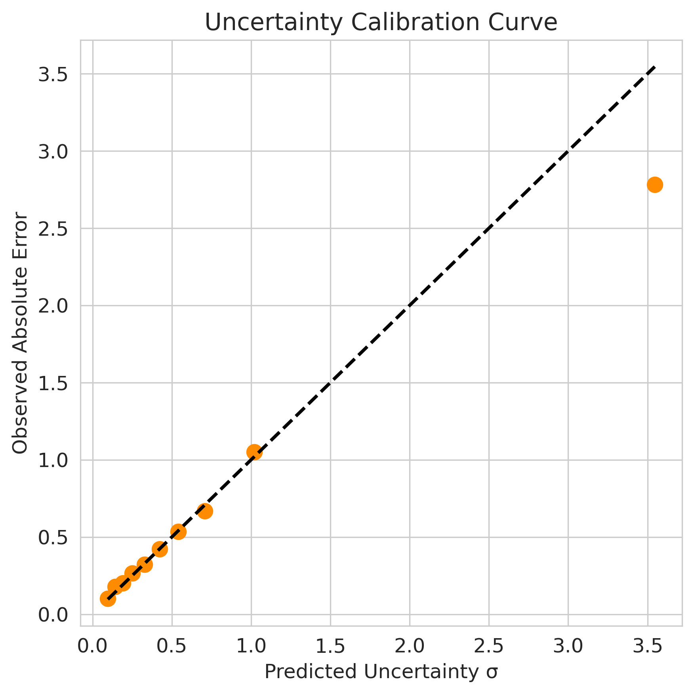

# Model Evaluation and Visualization Guide

This document provides a comprehensive overview of the visualizations used to evaluate the performance and reliability of the machine learning model for predicting **volume per atom (ų/atom)** in crystalline materials.

The model is trained on materials data and evaluated using a combination of **accuracy diagnostics, chemical interpretability analyses, and uncertainty-aware evaluation methods**. These visualizations collectively help assess not only how accurate the model is, but also **where it performs well, where it struggles, and how reliable its uncertainty estimates are**.

The figures below are designed to provide insights into:

- Overall regression performance
- Prediction reliability and uncertainty quantification
- Element-specific model behavior
- The effect of chemical complexity on prediction accuracy
- Calibration of uncertainty estimates

---

# 1. Density-Aware Parity Plot with Marginal Histograms

This figure evaluates the overall predictive accuracy of the **volume-per-atom regression model** by comparing predicted values against ground-truth values obtained from the Materials Project dataset.

The **x-axis** represents the predicted volume per atom, while the **y-axis** represents the true value from the dataset. A dashed diagonal line indicates the ideal **1:1 relationship**, where predictions perfectly match the ground truth.

Instead of using a traditional scatter plot, this visualization employs a **hexagonal density representation (hexbin plot)**. This approach avoids over-plotting and highlights regions where many data points are concentrated. Darker regions correspond to higher densities of predictions.

Marginal histograms are also included along the axes to show the **distribution of predicted and true volumes separately**. When the model performs well, the densest region of the hexbin plot aligns closely with the diagonal line.

This type of visualization is widely used in materials informatics literature because it provides a compact summary of regression performance across large datasets.

---

# 2. Deep Ensemble Uncertainty Bounds Parity Plot

This visualization illustrates both the **predicted values** and the **uncertainty associated with each prediction** using a deep ensemble model.

Each point represents the predicted volume per atom for a material in the dataset. The **vertical error bars correspond to the standard deviation of predictions across ensemble models**, which serves as an estimate of predictive uncertainty.

The dashed diagonal line represents the **ideal prediction line** where predicted and true values match perfectly.

Error bars provide important information about **model confidence**. Larger uncertainty bounds indicate that the model is less confident about its prediction. Ideally, predictions that deviate further from the parity line should also exhibit larger uncertainties.

This behavior suggests that the model is capable of **estimating its own reliability**, which is a critical property for real-world materials discovery pipelines.

---

# 3. Element-wise Volume Prediction Error

This visualization maps the **prediction error across elements in the periodic table** to identify chemical regions where the model performs better or worse.

For each compound in the test set, the **absolute prediction error** between the predicted and true volume per atom is calculated. These errors are then associated with the elements present in each compound.

The **mean absolute error (MAE)** is computed for each element across all materials containing that element. To ensure statistical reliability, elements appearing fewer than five times in the dataset are excluded.

The results are displayed as a **periodic table heatmap**, where color intensity represents the magnitude of prediction error.

- **Darker colors** indicate higher prediction errors.
- **Lighter colors** indicate more accurate predictions.

This visualization helps identify chemical regions where machine learning models struggle, such as transition metals or heavier elements with complex bonding environments.

---

# 4. Prediction Error vs Chemical Complexity

This plot explores how **prediction difficulty changes with chemical complexity**.

Chemical complexity is defined as the **number of unique elements present in a compound**.

- The **x-axis** shows the number of elements in the material composition.
- The **y-axis** shows the mean absolute prediction error for materials with that level of complexity.

Compounds containing more elements typically exhibit **more complex bonding environments and structural possibilities**, making them more challenging for machine learning models to predict accurately.

This visualization highlights an important limitation of composition-based models and helps identify scenarios where model predictions may become less reliable.

---

# 5. Uncertainty Calibration Curve

The uncertainty calibration plot evaluates whether the **model’s predicted uncertainty values correspond to the actual prediction error**.

The dataset is divided into bins based on predicted uncertainty values. For each bin:

- The **average predicted uncertainty** is calculated
- The **average observed prediction error** is computed

These values are plotted against each other.

The dashed diagonal line represents **perfect calibration**, where predicted uncertainty exactly matches the observed error.

If the points lie close to this line, the model’s uncertainty estimates are considered **well calibrated**.

Calibration is particularly important in materials discovery workflows, where researchers often rely on uncertainty estimates to prioritize the most reliable predictions.

---

# 6. Model Accuracy vs Uncertainty Filtering

This plot examines how model accuracy changes when predictions with the **highest uncertainty are progressively removed**.

The test set is first sorted based on predicted uncertainty values. Starting with the most confident predictions, increasingly larger fractions of the dataset are included while computing the mean absolute error.

- The **x-axis** represents the fraction of retained predictions.
- The **y-axis** represents the resulting mean absolute error.

If uncertainty estimates are meaningful, the curve should show that **predictions with lower uncertainty have significantly lower errors**, while including highly uncertain predictions increases the overall error.

This demonstrates that the model’s uncertainty estimates are **informative and actionable**, allowing unreliable predictions to be filtered out during large-scale materials screening.

---

# Overall Interpretation

Together, these six visualizations provide a **comprehensive evaluation of the model's predictive performance and reliability**.

- **Parity plots** evaluate regression accuracy and bias.
- **Periodic table heatmaps** reveal element-specific prediction behavior.
- **Complexity analysis** connects prediction errors to compositional difficulty.
- **Calibration and filtering plots** assess whether the model’s uncertainty estimates are meaningful and reliable.

By combining these analyses, researchers gain deeper insights into both **model accuracy and prediction confidence**, which is essential for deploying machine learning models in **materials discovery and computational materials science workflows**.
