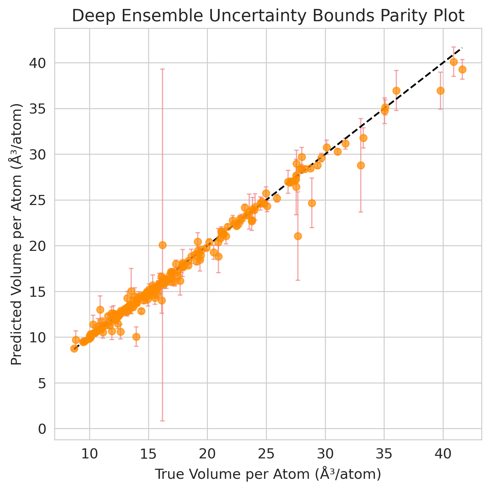
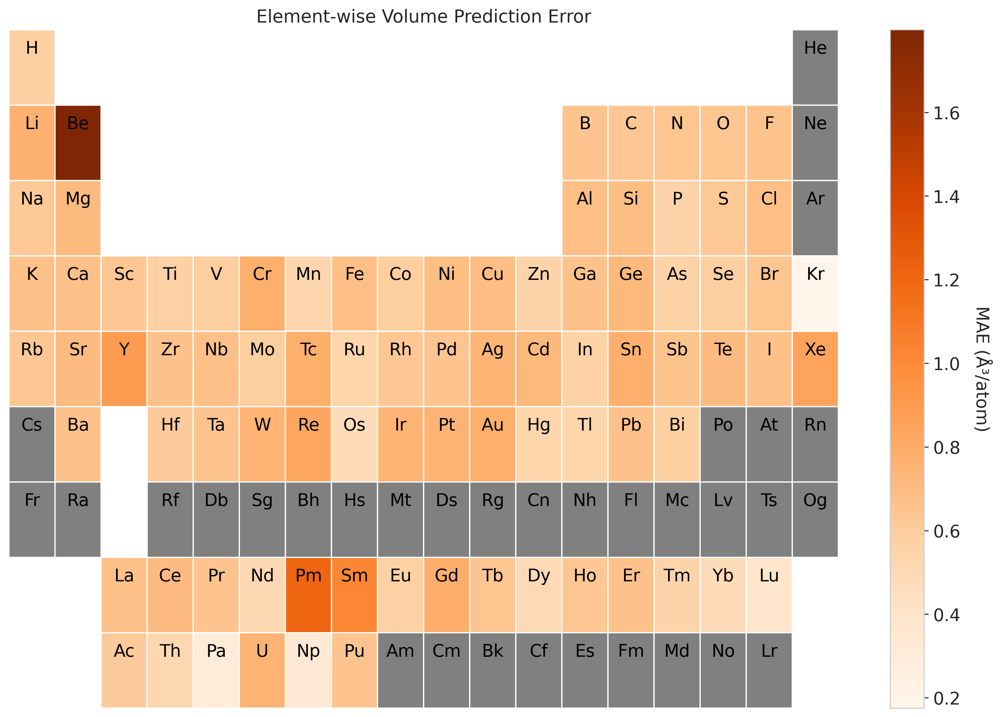
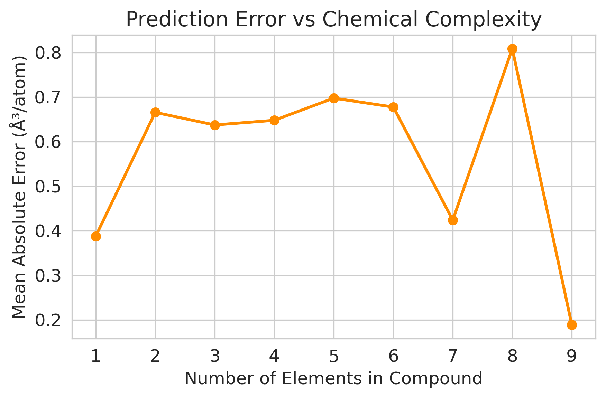
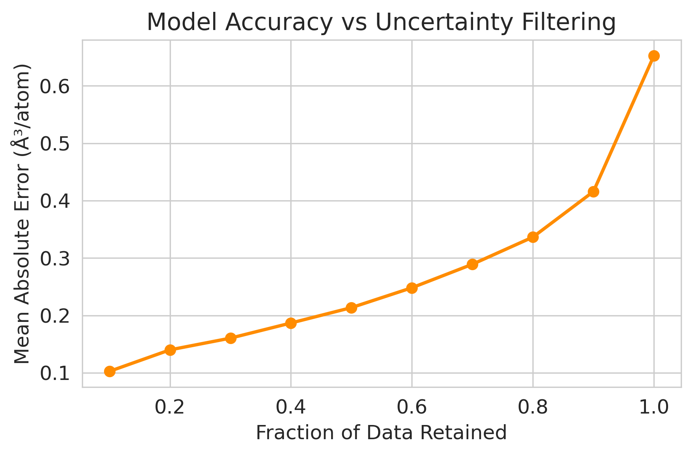

# Model Evaluation and Visualization Guide

This document provides a comprehensive overview of the visualizations used to evaluate the performance and reliability of the machine learning model for predicting **volume per atom (ų/atom)** in crystalline materials.

The model is trained on materials data and evaluated using a combination of **accuracy diagnostics, chemical interpretability analyses, and uncertainty-aware evaluation methods**. These visualizations collectively help assess not only how accurate the model is, but also **where it performs well, where it struggles, and how reliable its uncertainty estimates are**.

The figures below are designed to provide insights into:

- Overall regression performance
- Prediction reliability and uncertainty quantification
- Element-specific model behavior
- The effect of chemical complexity on prediction accuracy
- Calibration of uncertainty estimates

---

# 1. Density-Aware Parity Plot with Marginal Histograms

This figure evaluates the overall predictive accuracy of the **volume-per-atom regression model** by comparing predicted values against ground-truth values obtained from the Materials Project dataset.

The **x-axis** represents the predicted volume per atom, while the **y-axis** represents the true value from the dataset. A dashed diagonal line indicates the ideal **1:1 relationship**, where predictions perfectly match the ground truth.

Instead of using a traditional scatter plot, this visualization employs a **hexagonal density representation (hexbin plot)**. This approach avoids over-plotting and highlights regions where many data points are concentrated. Darker regions correspond to higher densities of predictions.

Marginal histograms are also included along the axes to show the **distribution of predicted and true volumes separately**. When the model is performing well, the densest region of the hexbin plot aligns closely with the diagonal line.

This type of visualization is commonly used in **materials informatics literature**, including studies based on architectures such as **MEGNet and CGCNN**, as it provides a compact overview of regression accuracy across large datasets. :contentReference[oaicite:0]{index=0}

---

# 2. Deep Ensemble Uncertainty Bounds Parity Plot

This visualization illustrates both the **predicted values** and the **uncertainty associated with each prediction** using a deep ensemble model.

Each point represents the predicted volume per atom for a material in the dataset. The **vertical error bars correspond to the standard deviation of predictions across ensemble models**, which serves as an estimate of predictive uncertainty.

The dashed diagonal line again represents the **ideal prediction line** where predicted and true values match perfectly.

Error bars provide important information about **model confidence**. Larger uncertainty bounds suggest that the model is less confident about its prediction. Ideally, predictions that deviate further from the parity line should also exhibit larger uncertainties.

This behavior indicates that the model is capable of **self-assessing its reliability**, which is critical for real-world materials discovery pipelines where incorrect predictions can lead to wasted computational resources.

Ensemble-based uncertainty quantification methods are frequently used in modern materials machine learning frameworks such as **Roost and other graph-based neural networks**. :contentReference[oaicite:1]{index=1}

---

# 3. Element-wise Volume Prediction Error

This visualization maps the **prediction error across elements in the periodic table** to identify chemical regions where the model performs better or worse.

For each compound in the test set, the **absolute prediction error** between the predicted and true volume per atom is calculated. These errors are then associated with the elements present in each compound.

The **mean absolute error (MAE)** is computed for each element across all materials containing that element. To maintain statistical reliability, elements appearing fewer than five times in the dataset are excluded.

The results are displayed as a **periodic table heatmap**, where color intensity represents the magnitude of the prediction error.

- **Darker colors** indicate higher prediction error.
- **Lighter colors** indicate more accurate predictions.

This type of visualization helps identify chemical regions where machine learning models may struggle, such as **transition metals or heavy elements**, which often exhibit complex bonding environments.

Periodic-table error analysis is widely used in modern materials informatics models such as **CrabNet and related architectures**, providing an interpretable connection between **model performance and chemical identity**. :contentReference[oaicite:2]{index=2}

---

# 4. Prediction Error vs Chemical Complexity

This plot explores how **prediction difficulty changes with chemical complexity**.

Chemical complexity is defined as the **number of unique elements present in a compound**.

- The **x-axis** shows the number of elements in the material composition.
- The **y-axis** shows the mean absolute prediction error for materials with that level of complexity.

In many materials datasets, compounds with more elements tend to have **more complicated bonding environments and structural variability**, making them harder for machine learning models to predict accurately.

The trend observed in this figure highlights an important challenge in materials informatics: **multi-component materials introduce additional structural and chemical complexity that increases prediction difficulty**.

Understanding this relationship helps researchers identify **where additional training data or model improvements may be needed**. :contentReference[oaicite:3]{index=3}

---

# 5. Uncertainty Calibration Curve

This visualization evaluates whether the **model’s predicted uncertainty corresponds to actual prediction error**.

The dataset is divided into bins based on the magnitude of predicted uncertainty. For each bin:

- The **average predicted uncertainty** is calculated
- The **average observed prediction error** is computed

These values are plotted against each other.

The dashed diagonal line represents **perfect calibration**, where predicted uncertainty exactly matches the observed error.

If the points lie close to this line, the model’s uncertainty estimates are considered **well calibrated**.

Calibration is especially important in **materials discovery workflows**, where researchers screen thousands of candidate materials. Reliable uncertainty estimates allow researchers to prioritize predictions that are both **accurate and trustworthy**. :contentReference[oaicite:4]{index=4}

---

# 6. Model Accuracy vs Uncertainty Filtering

This plot investigates how model accuracy changes when predictions with the **highest uncertainty are progressively filtered out**.

The dataset is sorted according to predicted uncertainty, and the mean absolute error is computed for progressively larger fractions of the retained dataset.

- The **x-axis** represents the fraction of retained predictions.
- The **y-axis** represents the resulting mean absolute error.

A decreasing error for smaller retained fractions indicates that **low-uncertainty predictions are significantly more reliable**.

This demonstrates that the model’s uncertainty estimates are **informative and actionable**.

In practical materials screening pipelines, such uncertainty-aware filtering allows researchers to **focus on the most reliable predictions while discarding uncertain ones**, improving the efficiency of computational materials discovery. :contentReference[oaicite:5]{index=5}

---

# Overall Interpretation

Together, these six visualizations provide a **comprehensive evaluation of the model**:

- **Parity plots** assess predictive accuracy and systematic bias.
- **Periodic table analysis** links model performance to chemical identity.
- **Complexity analysis** connects prediction errors to compositional difficulty.
- **Uncertainty calibration and filtering plots** evaluate whether the model’s confidence estimates are meaningful and reliable.

By combining these analyses, we gain a deeper understanding of both **model performance and reliability**, which is essential when deploying machine learning models in **materials discovery and computational design workflows**.
