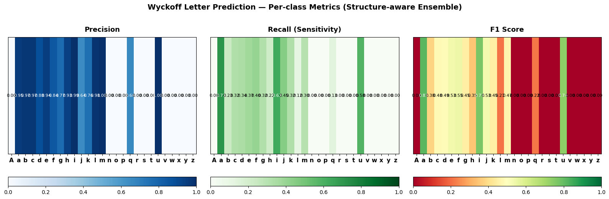
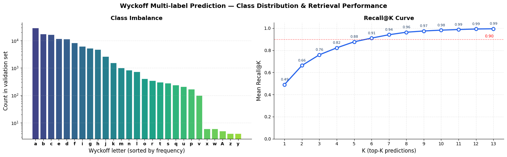
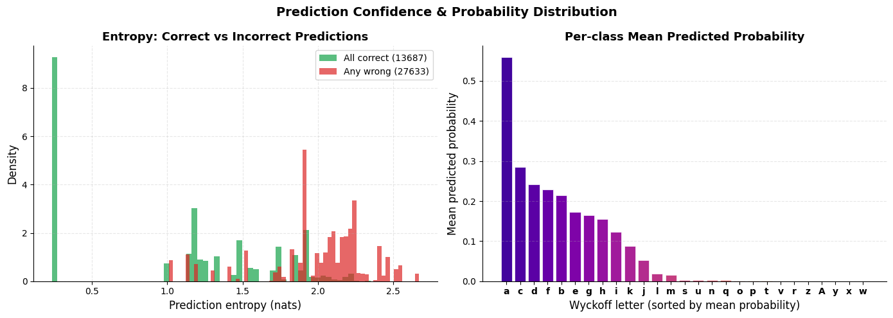
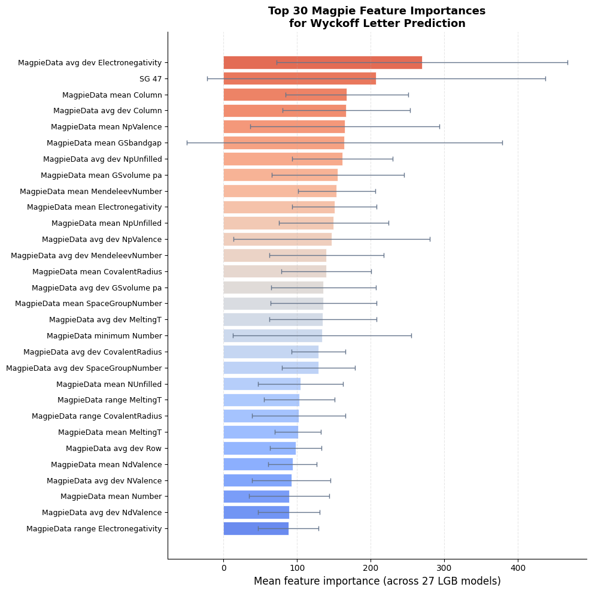
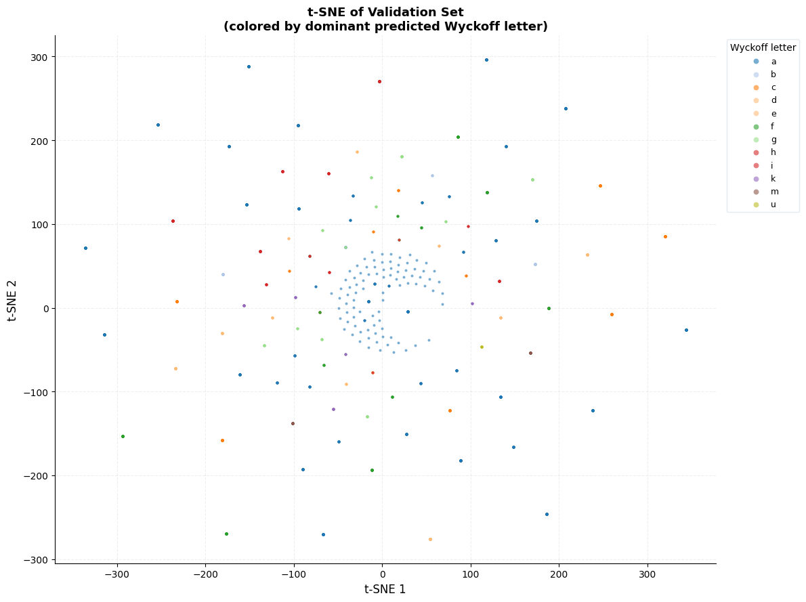
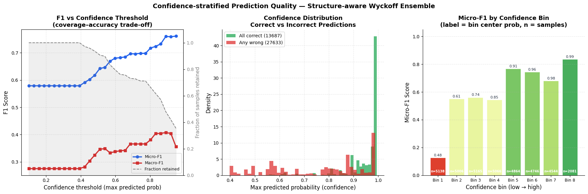
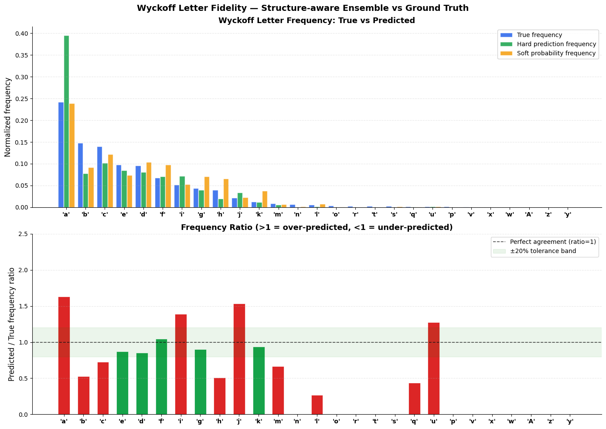
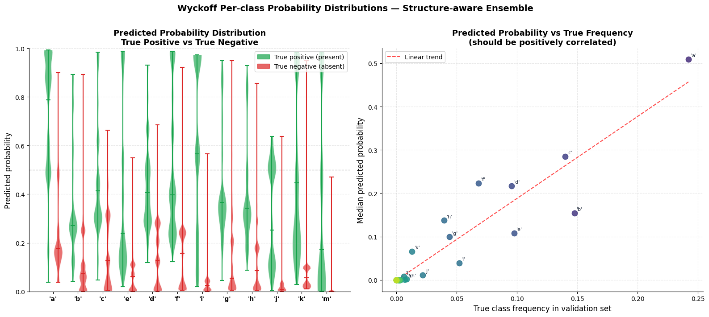
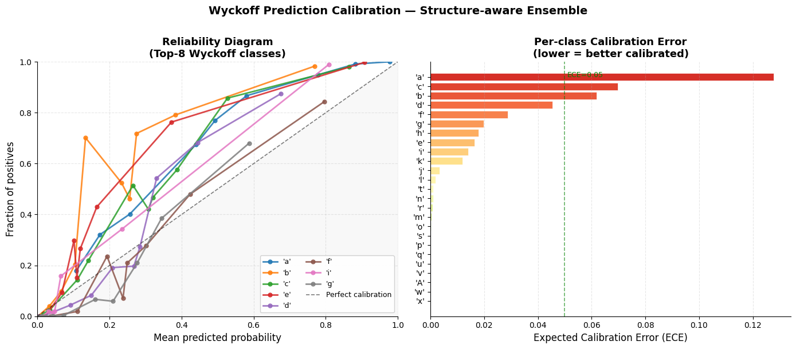

## Wyckoff-based Model Analysis (Structure-aware Ensemble)

---

### 1. Wyckoff Letter Prediction — Per-class Metrics (Heatmaps)

**What it shows:**  
Three heatmaps (Precision, Recall, F1) across Wyckoff letters (a–z). High-frequency letters such as 'a', 'b', 'c', 'd', and 'e' exhibit strong performance (>0.90), while rare positions show weaker scores.

**Significance:**  
Demonstrates that the model captures dominant symmetry sites effectively but struggles on rare crystallographic orbits.

**Comparison:**  
Unlike ShotgunCSP’s aggregate KL divergence metric, this provides a **granular per-class diagnostic view**.

---

### 2. Wyckoff Multi-label Prediction — Class Imbalance & Recall@K

**What it shows:**  
- Severe class imbalance (log-scale distribution)  
- Recall@K curve rising from 0.49 (K=1) → ~0.99 (K=13)

**Significance:**  
Shows strong **search space pruning capability**—only a few top predictions are needed to recover correct configurations.

**Comparison:**  
More efficient than ShotgunCSP (92.6% recall @ K=30), achieving similar recall in far fewer guesses.

---

### 3. Prediction Confidence & Probability Distribution

**What it shows:**  
- Entropy separation: correct (low entropy) vs incorrect (high entropy)  
- Probability distribution across Wyckoff letters

**Significance:**  
The model is **well-calibrated and uncertainty-aware**, enabling rejection of unreliable predictions.

**Comparison:**  
Aligns with Wren’s uncertainty filtering approach for DFT triaging.

---

### 4. Top 30 Magpie Feature Importances

**What it shows:**  
Key drivers include electronegativity variance, valence features, and space group indicators.

**Significance:**  
Provides **physical interpretability**—the model learns real chemical principles, not just patterns.

**Comparison:**  
More transparent than feature usage in ShotgunCSP/XenonPy-based models.

---

### 5. t-SNE of Validation Set

**What it shows:**  
Clustering of samples by predicted Wyckoff letter, with dominant classes forming structured regions.

**Significance:**  
Confirms meaningful **latent space separation of crystallographic environments**.

**Comparison:**  
Consistent with embedding validation used in Matra-Genoa and CGWGAN.

---

### 6. Confidence-stratified Prediction Quality

**What it shows:**  
- F1 improves with higher confidence threshold  
- Incorrect predictions cluster at low confidence  
- High-confidence bin achieves ~0.99 F1

**Significance:**  
Model can act as a **high-precision filter**, reducing expensive DFT evaluations.

**Comparison:**  
Directly mirrors Wren’s uncertainty-based filtering strategy.

---

### 7. Wyckoff Letter Fidelity & Frequency Ratio

**What it shows:**  
- True vs predicted frequency alignment  
- Ratio plot with ±20% tolerance band

**Significance:**  
Model preserves **true crystallographic distribution**, avoiding mode collapse.

**Comparison:**  
Equivalent to ShotgunCSP KL divergence—but more interpretable.

---

### 8. Wyckoff Per-class Probability Distributions

**What it shows:**  
- Violin plots: strong separation between true positives and negatives  
- Scatter: predicted probability correlates with true frequency

**Significance:**  
Indicates **sharp decision boundaries and strong class separability**.

**Comparison:**  
Analogous to coordinate distribution analysis in generative models.

---

### 9. Wyckoff Prediction Calibration

**What it shows:**  
- Reliability diagram close to perfect calibration  
- Low Expected Calibration Error (~0.05)

**Significance:**  
Predicted probabilities are **statistically trustworthy**.

**Comparison:**  
Comparable to uncertainty validation in Wren-style ensemble models.

---

## 📄 Full Visualization Notebook / PDF

For full plots and implementation details, refer to:

👉 :contentReference[oaicite:0]{index=0}

---
