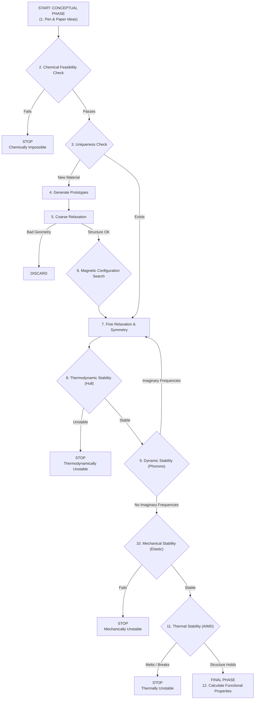

```mermaid
flowchart TD
    A["START: CONCEPTUAL PHASE<br>(1. Pen & Paper Ideas)"]
    A --> B{"2. Chemical Feasibility Check"};
    B -- "Fails" --> B_FAIL["STOP<br>Chemically Impossible"];
    B -- "Passes" --> C{"3. Uniqueness Check"};
    C -- "New Material" --> D["4. Generate Prototypes"];
    C -- "Exists" --> G;
    D --> E["5. Coarse Relaxation"];
    E -- "Bad Geometry" --> E_FAIL["DISCARD"];
    E -- "Structure OK" --> F{"6. Magnetic Configuration Search"};
    F --> G["7. Fine Relaxation & Symmetry"];
    G --> H{"8. Thermodynamic Stability (Hull)"};
    H -- "Unstable" --> H_FAIL["STOP<br>Thermodynamically Unstable"];
    H -- "Stable" --> I{"9. Dynamic Stability (Phonons)"};
    I -- "Imaginary Frequencies" --> G;
    I -- "No Imaginary Frequencies" --> J{"10. Mechanical Stability (Elastic)"};
    J -- "Fails" --> J_FAIL["STOP<br>Mechanically Unstable"];
    J -- "Stable" --> K{"11. Thermal Stability (AIMD)"};
    K -- "Melts / Breaks" --> K_FAIL["STOP<br>Thermally Unstable"];
    K -- "Structure Holds" --> L["FINAL PHASE<br>12. Calculate Functional Properties"];
```
